<div align="center">
  
</div>

<div align="center">

<a href="https://rishavchakravarty.com"></a>
<a href="https://www.linkedin.com/in/rishav-dsc"></a>
<a href="mailto:rishavchakra@umass.edu"></a>


</div>

<div align="center">
  
</div>

---

## 🧭 About

I'm a **psychology brain with an engineer's hands.** I'm finishing an **M.S. in Data Analytics & Computational Social Science (DACSS)** at **UMass Amherst**, where I study how human behavior leaves a trace in data — social networks, mental health signals, urban mobility — and then build the models and interfaces that make those findings usable by someone who isn't a statistician.

Before UMass: a **PG Diploma in Data Science & Business Analytics (UT Austin)** and a **B.S. in Psychology with a CS minor (Virginia Tech)**. That combination is the whole point — I care as much about *why* people do the thing as about the AUC of the model that predicts it.

```python
rishav = {
    "role":      "Data Scientist / Analyst · Computational Social Scientist",
    "based_in":  "Amherst, MA",
    "studying":  "M.S. Data Analytics & Computational Social Science @ UMass",
    "working_on": ["network inference", "behavioral experiments", "analytics dashboards"],
    "ask_me_about": ["ERGMs", "A/B testing", "feature engineering", "shipping the dashboard"],
    "status":    "open to Data Science & Analytics roles",
}
```

---

## 🧰 Toolbox

**Languages**


**Data science & ML**


**Statistics, viz & BI**


**Build & ship**


---

## 🔬 Research & computational social science

> Where most of my current energy goes: inference on human behavior, not just prediction.

| Project | The question | Method & stack |
|---|---|---|
| **Physical Co‑Presence, Communication & Facebook Friendship** | Do Bluetooth proximity and SMS traffic actually predict who becomes friends? Modeled across **6,429 friendship ties** in the Copenhagen Networks Study. | `R` · ERGM · RSiena · community detection · network statistics |
| **[Mental Health & Social Media](https://github.com/rishav-dev/MentalHealthResearch-SocialMedia)** | How do social‑media behavior signals track with self‑reported mental health outcomes? | `Python` · pandas · EDA · statistical testing |
| **AI Advice‑Seeking Experiment** | Do people judge you differently for taking advice from a chatbot vs. a friend vs. a therapist? Randomized survey experiment. | `R` · tidyverse · ANOVA · survey design |
| **Scheduling Structure & Task Completion Time** | Does load imbalance *interact* with deadline pressure to slow task completion? | `R` · linear regression · moderation analysis · HC3 robust SEs |
| **[StressMap](https://github.com/rishav-dev/StressMap)** | Scoring Level of Traffic Stress for real street networks from OpenStreetMap data. | `Python` · Jupyter · geospatial · OSM |

---

## 📊 Applied ML & business analytics

<table>
<tr><td width="50%" valign="top">

**Prediction & classification**
- **ReneWind** — turbine generator failure prediction from sensor data, tuned for preventive maintenance recall  <br/>`classification · sampling · regularization · hyperparameter tuning`
- **EasyVisa** — visa certification outcomes with boosted ensembles  <br/>`Random Forest · AdaBoost · Gradient Boosting · XGBoost · GridSearchCV`
- **INN Hotels** — which bookings signal cancellation risk before arrival  <br/>`logistic regression · decision trees · AUC‑ROC`
- **Face Recognition** — real‑time detection at **93% accuracy**, tuned for inference speed  <br/>`TensorFlow · GPU acceleration`

</td><td width="50%" valign="top">

**Pricing, segmentation & experimentation**
- **ReCell** — dynamic pricing for **20,000+** refurbished devices; isolating true resale‑value drivers  <br/>`regression · EDA · business analytics`
- **Trade&Ahead** — clustering stocks into interpretable groups for portfolio diversification  <br/>`K‑means · hierarchical clustering`
- **E‑news Express** — A/B test on a new landing page, segmented by language preference  <br/>`hypothesis testing · A/B testing`
- **FoodHub** — operational recommendations from food‑aggregator order data  <br/>`EDA · univariate/bivariate analysis`

</td></tr>
</table>

---

## 🛠️ I ship things too

<div align="center">
  <a href="https://github.com/rishav-dev/nutri-navigator-app">
    
  </a>
  <a href="https://github.com/rishav-dev/rishav-dev.github.io">
    
  </a>
</div>

<div align="center">
  <a href="https://github.com/rishav-dev/MentalHealthResearch-SocialMedia">
    
  </a>
  <a href="https://github.com/rishav-dev/690s-final">
    
  </a>
</div>

- 🥗 **nutri-navigator-app** — cross‑platform nutrition app in Flutter/Dart
- 🌐 **rishav-dev.github.io** — my portfolio in TypeScript → [rishavchakravarty.com](https://rishavchakravarty.com)
- 🧪 **690s-final** — DACSS coursework, in JavaScript

---

## 📈 The numbers

<div align="center">


</div>

---

## 🏆 Recognition


---

## 🎯 Currently

```
[▓▓▓▓▓▓▓▓▓▓▓▓▓▓▓▓▓▓░░]  M.S. DACSS @ UMass Amherst
[▓▓▓▓▓▓▓▓▓▓▓▓░░░░░░░░]  Network inference on real social data
[▓▓▓▓▓▓▓▓░░░░░░░░░░░░]  Porting my analytics projects onto GitHub
[▓▓▓▓▓▓▓▓▓▓▓▓▓▓▓▓▓▓▓▓]  Coffee
```

> **🟢 Open to Data Science, Data Analytics & Research roles.** If you're building something where behavior and data meet, I'd like to hear about it.

<div align="center">

<a href="mailto:rishavchakra@umass.edu"></a>
<a href="https://www.linkedin.com/in/rishav-dsc"></a>
<a href="https://rishavchakravarty.com"></a>

</div>

<div align="center">
  <sub><code>signal &gt; noise</code></sub>
</div>
