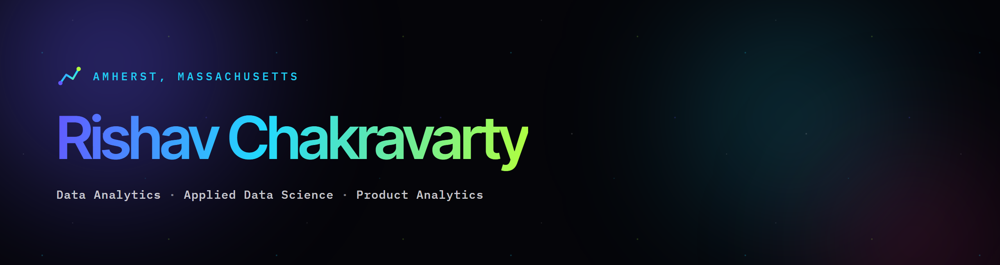
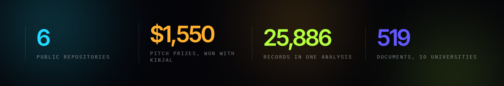

  

  

  <b>Every number above links to something on this profile you can open and check.</b>

 

## About

I came into data science through psychology. Four years of behavioural research
before I wrote a line of production code, which is why I tend to start with the
decision a person actually made rather than the feature that happens to
correlate with it.

I am finishing an **M.S. in Data Analytics and Computational Social Science** at
UMass Amherst. Before that, a postgraduate diploma at UT Austin and a B.S. in
Psychology with a computer science minor at Virginia Tech. I ran a dining hall
for five and a half years while doing most of it.

Everything below is a public repository. Clone it, run it, check my numbers
against my data. If I cannot link it, it is not on this page.

 

## Work you can open

<table>
<tr>
<td width="50%" valign="top">

### [Mental Health Signal on Reddit](https://github.com/rishav-dev/MentalHealthResearch-SocialMedia)

6,398 posts and 19,488 comments out of r/Anxiety, r/depression and
r/mentalhealth. Every item scored three separate ways, then three
classifiers put against each other on the labels.

Raw CSVs, scored CSVs, model results and the Dash dashboard are all in
the repo.

`Python` `PRAW` `scikit-learn` `NLTK VADER` `Transformers` `Plotly Dash`

</td>
<td width="50%" valign="top">

### [Campus Safety Alerts, Ten Universities](https://github.com/rishav-dev/Project-DACSS-758)

Ten universities publish their crime alerts ten different ways, so I
wrote ten bespoke scrapers and one comparable dataset out the other side.
HTML and PDF, 506 and 13.

Every row carries the archive URL, source URL, content hash and scrape
timestamp.

`Python` `BeautifulSoup` `pdfminer.six` `cloudscraper`

</td>
</tr>
<tr>
<td width="50%" valign="top">

### [The Evolution of the Billboard Hot 100](https://github.com/rishav-dev/690s-final)

An argument you scroll through rather than a dashboard you poke at.
Billboard chart data joined to Spotify audio features, 2000 to 2023,
ending in a 3D pass through the feature space.

Missing numerics are filtered, not imputed. A quietly imputed audio
feature is a lie you then plot.

`D3.js` `Three.js` `JavaScript` `Python`

</td>
<td width="50%" valign="top">

### [Misere Nim Agent](https://github.com/rishav-dev/nim-agent)

Iterative-deepening minimax with alpha-beta pruning, a transposition
table keyed on sorted pile shape, and move ordering from a misere
specific evaluator.

The server allows one second. I budget 0.82 and compute a known-good
fallback before the search starts, so a slow board still returns a legal
move.

`Python` `Minimax` `Alpha-beta pruning` `Memoisation`

</td>
</tr>
</table>

<b>The number I would defend in a room, from the Reddit study</b>

 

Logistic regression and the random forest tied. The SVM was a hair behind.

| Model | Accuracy | Precision | Recall | F1 |
|---|---|---|---|---|
| Logistic Regression | 0.9125 | 0.8327 | 0.9125 | 0.8708 |
| Random Forest | 0.9125 | 0.8327 | 0.9125 | 0.8708 |
| Linear SVM | 0.9063 | 0.8322 | 0.9063 | 0.8676 |

Those three are closer to each other than any of them is to a careful reading of
what the labels actually mean, and I think that is the honest thing to say about
this kind of work.

The finding worth having came from the topic modelling instead. The clusters are
mostly **not** about mental health. They are about money, housing, politics and
social media. The subreddit is where people go to talk about anxiety, and what
they talk about is rent.

Figures are in `ml_model_results.csv` in the repo.

<b>Two more repositories</b>

 

**[nutri-navigator-app](https://github.com/rishav-dev/nutri-navigator-app)** `Dart`
The NutriNavigator client, built in Flutter. One of the six Kinnovation ventures.

**[rishav-dev.github.io](https://github.com/rishav-dev/rishav-dev.github.io)** `TypeScript`
My portfolio, hand-built. Next.js static export, a WebGL boot sequence written
against raw WebGL2 rather than a library, and an assistant that runs on a
Cloudflare Worker so there is no API key anywhere in the client.

 

## Kinnovation

A venture studio I co-founded with **[Kinjal Pandey](https://kinjalpandey.com/)**.
Six ventures, all joint work, all built by the two of us:
[Karnah](https://kinnovationgroup.com/karnah),
[CalendAI](https://kinnovationgroup.com/calendai),
[MeAsmi](https://kinnovationgroup.com/measmi),
[NutriNavigator](https://kinnovationgroup.com/nutri-navigator),
[Witness](https://kinnovationgroup.com/witness-platform), and Trendify AI.

Three pitch competitions, **$1,550** in prize money, won together. Neither of us
has ever pitched alone.

| Venture | Prize | Competition | Awarded by | When |
|---|---|---|---|---|
| Karnah | **$750**, second place | UPitch Spring 2026 | UMass Amherst Entrepreneurship Club | Apr 2026 |
| CalendAI | **$500** | Pitch competition | Apex Center for Entrepreneurs, Virginia Tech | Nov 2024 |
| Trendify AI | **$300** | Minute Pitch | Berthiaume Center, UMass Amherst | Oct 2025 |

All six are in development or at concept stage. None is a launched commercial
product and none is fundraising. More at
**[kinnovationgroup.com](https://kinnovationgroup.com)**.

 

## Stack

**Languages**

**Machine learning and analysis**

**Visualisation**

**Platforms**

 

## Also

**The Action Taker Award**, LISC Massachusetts and the IXL Center, 2025. Given
for leading the digital upgrades through their Digital Growth Accelerator. The
name is the part I liked. It was for executing, not for proposing.

Selected for the **Franklin County CDC Entrepreneurs Accelerator**, Spring 2026.

**IBM Z Xplore**, Mainframes and Machine Learning.

 

  

  Amherst, Massachusetts · <a href="mailto:rishavchakra@umass.edu">rishavchakra@umass.edu</a>

